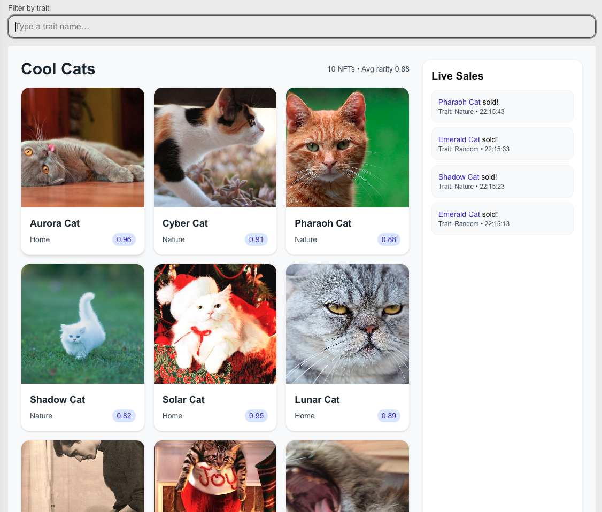
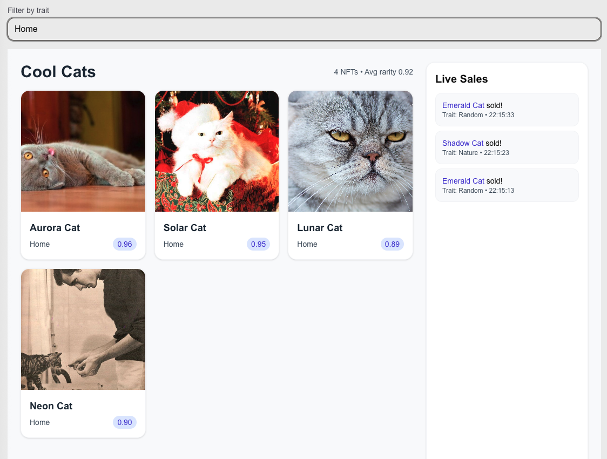

# NFT Metadata & Analytics Dashboard

A full-stack C# + GraphQL + Next.js + Tailwind project that showcases a modern developer workflow and real-world architecture.

This project implements a GraphQL-powered NFT Metadata & Analytics Service, indexing NFT collections, metadata, and live market activity. Built with .NET 8 (HotChocolate) and a React/Next.js frontend (Apollo Client), it features:

- .NET 8 GraphQL API exposing collections, traits, rarity scores, and market metrics

- Integration-ready backend designed for blockchain APIs (such as Moralis, Alchemy, or Tezos endpoints)

- Scheduled ingestion pipeline extendable with Hangfire or Quartz.NET for periodic data updates

- GraphQL Subscriptions providing real-time updates for NFT sales and collection trends

- Modern React/Next.js UI with a clean, responsive dashboard built using Tailwind CSS

- AI-ready architecture supporting AI-generated trend summaries (for example, “This collection’s floor price rose 12% this week due to X factor”) via OpenAI or Azure Cognitive Services

## Preview

<div style="display: flex; justify-content: space-around;">
  <div style="text-align: center;">
    
    <p>Dashboard with live sales sidebar</p>
  </div>
  <div style="text-align: center;">
    
    <p>Filtered dashboard sidebar</p>
  </div>
</div>

## Tech Stack

- **Backend:**  
  - ASP.NET Core 8  
  - HotChocolate GraphQL  
  - Entity Framework Core (SQLite)  
  - Serilog (logging)

- **Frontend:**  
  - Next.js (App Router)  
  - React + TypeScript  
  - Apollo Client  
  - Tailwind CSS  

## Features

| Layer | Tech | Highlights |
|-------|------|-------------|
| **Backend** | .NET 8 + HotChocolate | GraphQL API, EF Core (SQLite), schema-first design, computed rarity, subscriptions |
| **Frontend** | Next.js + React + TypeScript | Apollo Client, responsive layout, Tailwind styling |
| **Live Updates** | GraphQL Subscriptions | Real-time sales feed using in-memory publisher |
| **Database** | EF Core + SQLite | Lightweight local DB seeded with “Mystic Cats” collection |
| **Dev Workflow** | VS Code + Hot Reload | Rapid iteration, single-command dev setup |

## Getting Started

### Prerequisites

- .NET 8 SDK
- Node.js 18+
- npm or yarn

### Backend Setup

1. Navigate to the API directory:
   ```
   cd api/src/NFTGraphAPI
   ```

2. Restore dependencies:
   ```
   dotnet restore
   ```

3. Run the API:
   ```
   dotnet run
   ```
   The API will be available at `http://localhost:5030/graphql`.

### Frontend Setup

1. Navigate to the web directory:
   ```
   cd web
   ```

2. Install dependencies:
   ```
   npm install
   ```

3. Run the development server:
   ```
   npm run dev
   ```
   The app will be available at `http://localhost:3000`.

